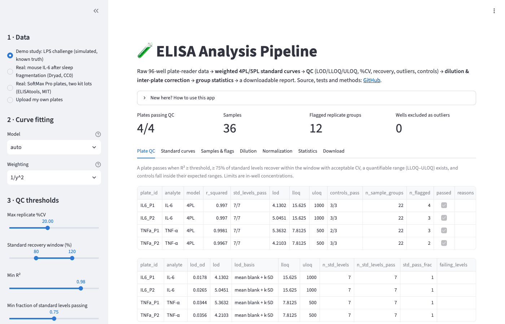
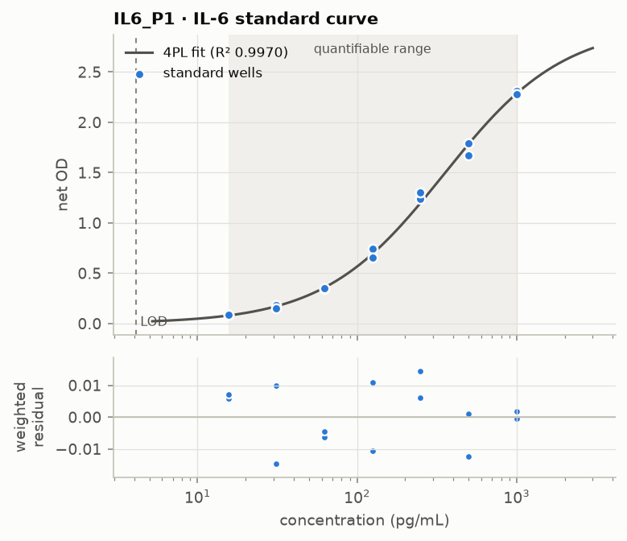

# ELISA Analysis Pipeline

[](https://github.com/Tejas12972/elisa-analysis-pipeline/actions/workflows/ci.yml)
[](LICENSE)

A Python pipeline for sandwich ELISA data. You give it raw 96-well plate-reader exports and a
plate layout. It fits the standard curves, runs QC, converts ODs to concentrations, compares
treatment groups, and writes an HTML report.

**[Live demo](https://tejas12972.github.io/elisa-analysis-pipeline/app/)** ·
[example report](https://tejas12972.github.io/elisa-analysis-pipeline/reports/demo_report.html) ·
[real-data notebook](https://nbviewer.org/github/Tejas12972/elisa-analysis-pipeline/blob/main/notebooks/01_sleep_fragmentation_il6.ipynb)

The demo is the Streamlit app compiled to WebAssembly with
[stlite](https://github.com/whitphx/stlite), so it runs in your browser with no backend. The
first load takes around 30 seconds.



## What it does

1. Reads plate exports: 8×12 grids, long tables, or SoftMax Pro text files, as CSV, TSV or
   Excel. It checks them against the layout and reports every problem at once.
2. Subtracts the blank and fits a weighted 4PL or 5PL curve to each plate. The model is picked
   by AICc.
3. Flags outlier wells, computes %CV and % recovery, and works out LOD, LLOQ and ULOQ. Each
   plate passes or fails against FDA/ICH M10-style criteria.
4. Corrects for dilution and checks dilution linearity.
5. Normalizes across plates using bridge controls.
6. Compares groups:
   - Welch t or Mann-Whitney for two groups, Welch ANOVA or Kruskal-Wallis for more;
   - fold changes with 95% CIs;
   - Benjamini-Hochberg correction across analytes.

Each step lives in its own module under `src/immunoassay/`. The reasoning behind the choices
is in the docstrings.

## Real data

I tested it on two public datasets. The notebooks are in `notebooks/`.

**Mouse serum IL-6 after sleep fragmentation** (Nguyen et al., Dryad
[doi:10.5061/dryad.tdz08kq3p](https://doi.org/10.5061/dryad.tdz08kq3p), CC0). The study has
110 mice on 4 plates.
- The original analysis used straight-line calibrations, which recover the study's own
  standards at 28–142% of nominal. The 4PL recovers 94–102%.
- 100 of the 110 samples read below the lowest quantifiable standard.
- If you treat those extrapolated values as data anyway (as the original analysis did),
  IL-6 is still higher after sleep fragmentation at 6, 12 and 24 h.

**SoftMax Pro plates from the ELISAtools R package** (MIT). These are five triplicate plates
across two kit lots.
- The pipeline's outlier rule removed 4 wells, and the original analyst had removed the same 4.
- The analyst also removed 13 wells from groups that already met the 20% CV limit.
- A QC control run on every plate shows the second kit lot reading about 30% low.

The simulated demo study comes with known true concentrations, so accuracy can be measured.
The pipeline gets within 8% of the truth (median). The tests check this.



## Quickstart

```bash
git clone https://github.com/Tejas12972/elisa-analysis-pipeline.git
cd elisa-analysis-pipeline
python3 -m venv .venv && source .venv/bin/activate
pip install -e ".[dev,app]"

pytest
immunoassay simulate --out data/simulated/demo
immunoassay run data/simulated/demo/manifest.csv --out reports/demo --group-order "vehicle,LPS,LPS+drug"
streamlit run app/streamlit_app.py
```

From Python:

```python
from immunoassay.pipeline import PipelineConfig, run_pipeline

result = run_pipeline("data/simulated/demo/manifest.csv", PipelineConfig())
result.plate_qc  # pass/fail per plate
result.results  # concentration per sample, with flags
result.stats.pairwise  # group comparisons
```

To run your own data, write a manifest CSV (`plate_file, layout_file, analyte`) and a layout
per plate (`well, type, sample_id, concentration, dilution, group`). Examples are in
`data/simulated/demo/`.

## Background

In a sandwich ELISA the analyte is captured by one antibody and detected by a second,
enzyme-linked one. More analyte means more color, which the plate reader measures as optical
density (OD). Every plate also runs standards of known concentration. The fitted standard curve
converts sample ODs into concentrations.

The curve is S-shaped:
- At low concentration the signal sits at background.
- In the middle it rises with log concentration.
- At high concentration the capture antibody saturates.

The 4PL model describes this shape:

$$y = d + \frac{a - d}{1 + (x/c)^{b}}$$

The four parameters are:
- *a*: the response at zero concentration;
- *d*: the response at saturation;
- *c*: the midpoint (EC50);
- *b*: the slope.

The 5PL adds an asymmetry term, and it's only used when it clearly fits better.

The fit is weighted because ELISA noise grows with the signal. Unweighted least squares lets
the high standards dominate and fits the low end badly, and the low end is where most samples
land. Weighting by 1/y² assumes a roughly constant CV.

Definitions used here:
- **%CV**: SD / mean of replicate wells. The limit is 20%.
- **% recovery**: back-calculated ÷ nominal concentration of a standard. The acceptable range is
  80–120%, widened to 75–125% at the curve ends.
- **LOD**: mean blank + 3 SD, converted to concentration. Below this you can't tell a sample
  from zero.
- **LLOQ / ULOQ**: the lowest and highest standards that recover accurately with acceptable
  CV. Samples outside this range get flagged instead of reported as numbers.
- **Dilution linearity**: the same sample run at different dilutions should agree after
  correction. If it doesn't, that points to matrix interference or the hook effect.

A few choices worth explaining:
- **Outliers:** Grubbs' test doesn't work with only 3 replicates, so a median-based rule is used
  instead. It only runs on groups that already fail the CV limit.
- **Values below LLOQ:** these are replaced with LLOQ/√2 instead of dropped. Dropping them
  would bias the low groups upward.
- **Controls:** these are checked before plate normalization, because normalization is built
  from the controls and would hide their failures.

## Testing

- 135 tests covering parsing, curve math, QC rules, stats, the app, and full end-to-end runs on
  simulated data.
- CI runs the tests on Python 3.11–3.13. It also runs them against the older library versions
  the browser uses.
- Before each deploy, a headless browser loads the live app and runs every dataset.

## Layout

```
src/immunoassay/   package: io, curves, qc, dilution, normalize, stats, simulate, report
app/               Streamlit app
notebooks/         real-data analyses
scripts/           data converters, notebook and site builders, browser test
data/              raw public data (with provenance), processed inputs, simulated demo
tests/
```

## License

MIT. The bundled datasets keep their own licenses: the Dryad data is CC0 and ELISAtools is MIT.
See `data/raw/*/PROVENANCE.md`.
