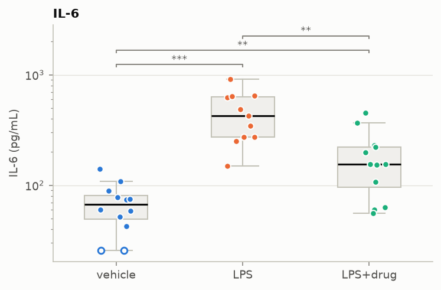
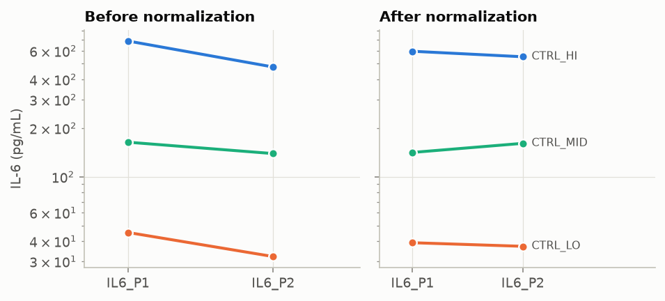
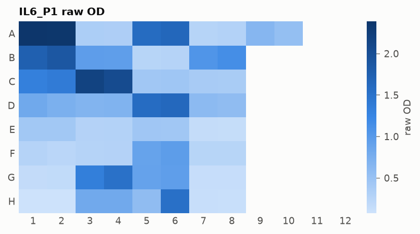

<div align="center">

# 🧪 ELISA Analysis Pipeline

**From raw 96-well plate-reader data to quality-controlled concentrations, statistics, and an audit-ready report.**

[](https://github.com/Tejas12972/elisa-analysis-pipeline/actions/workflows/ci.yml)
[](https://github.com/Tejas12972/elisa-analysis-pipeline/actions/workflows/pages.yml)


### [▶ Try the live app](https://tejas12972.github.io/elisa-analysis-pipeline/app/) · [Project page](https://tejas12972.github.io/elisa-analysis-pipeline/) · [Example report](https://tejas12972.github.io/elisa-analysis-pipeline/reports/demo_report.html) · [Real-data notebook](https://nbviewer.org/github/Tejas12972/elisa-analysis-pipeline/blob/main/notebooks/01_sleep_fragmentation_il6.ipynb)

</div>


> The live app runs **entirely in your browser**: Python, SciPy and Streamlit compiled to
> WebAssembly, served from GitHub Pages. No server, no install, nothing uploaded. The first
> load takes ~30 s while the scientific Python stack downloads.

---

## At a glance

| | |
|---|---|
| **Problem** | ELISA is the workhorse assay for measuring proteins (cytokines, biomarkers, drug levels). Turning its raw optical densities into trustworthy concentrations takes curve fitting, QC against regulatory criteria, dilution and plate corrections, and careful statistics. In practice this often lives in fragile spreadsheets. |
| **What I built** | A modular, fully tested Python package covering the whole workflow: plate parsing, weighted 4PL/5PL fitting, QC (LOD/LLOQ/ULOQ, %CV, recovery, outliers, controls), dilution linearity, inter-plate normalization, and group statistics. It ships with a CLI, an HTML report generator, and an interactive app. |
| **How it's validated** | A simulator with **known ground truth** (the pipeline recovers true concentrations to a median error < 8%). 135 automated tests (97% coverage), CI on Python 3.11–3.13 *plus* the exact package versions of the in-browser runtime, and a real-browser smoke test gating every deploy. |
| **Real-world use** | Re-analysis of **two public datasets**: a published mouse IL-6 study (Dryad, CC0) and five real SoftMax Pro plates across two kit lots (ELISAtools, MIT). Both surfaced findings the original analyses missed. |
| **Stack** | Python · NumPy · pandas · SciPy · statsmodels · matplotlib · Streamlit · stlite/Pyodide (WebAssembly) · pytest · ruff · GitHub Actions · GitHub Pages |

## Highlights

- **Scientifically grounded.** Every threshold follows FDA (2018) / ICH M10 bioanalytical
  guidance, and every modelling choice is explained in the code and below. Examples: why
  weighted regression, why a CV-gated median rule instead of Grubbs, why censored values are
  substituted rather than dropped.
- **Honest with real data.** The pipeline shows where a published analysis over-reaches.
  100 of 110 samples were below the assay's validated range, yet were reported as numbers. It
  then shows which conclusions survive a labelled sensitivity analysis.
- **Engineered like production code.** Validation reports *every* input problem at once, the
  stage order is deliberate and documented, configuration is serialised into each report,
  results are reproducible, and the design is modular and typed.
- **Deployed and tested end-to-end.** CI runs a headless browser that boots the WebAssembly
  app and exercises all three datasets. It caught a real bug where SciPy 1.14 (in the browser)
  behaves differently from newer SciPy on tied data.

---

## Results on real data

### 1 · Serum IL-6 after acute sleep fragmentation → [notebook](notebooks/01_sleep_fragmentation_il6.ipynb)

Nguyen, Fields & Ashley, [doi:10.5061/dryad.tdz08kq3p](https://doi.org/10.5061/dryad.tdz08kq3p) (CC0).
The study has 110 mice: sleep-fragmented (ASF) vs undisturbed controls (NSF), measured over
0–24 h on four plates. The original analysis calibrated each plate with a hand-typed straight
line.

| Finding | Evidence |
|---|---|
| The original linear calibrations are inaccurate | They recover the authors' own standards at **28–142%** of nominal. The weighted 4PL recovers **94–102%** on the best plate. |
| One plate fails acceptance | Only 4/7 standard levels meet the criteria (≥ 75% are required). |
| Most samples cannot be quantified | **100 / 110** are below the LLOQ, which is expected for baseline mouse IL-6. The published values are extrapolations below the lowest standard. |
| The qualitative biology survives | A labelled sensitivity analysis (rank-based, BH-corrected) reproduces higher IL-6 after sleep fragmentation at **6, 12 and 24 h** (p<sub>BH</sub> = 0.001, 0.002, 0.025). |
| Magnitudes do not survive | Fold changes are ratios of extrapolations, and the 6 h contrast crosses plates with no bridge controls. |

### 2 · Real SoftMax Pro plates across two kit lots → [notebook](notebooks/02_elisatools_softmax_qc.ipynb)

Example data from the R package ELISAtools (Feng Feng, MIT): five triplicate plates across two
kit lots, with a shared QC control on every plate.

| Finding | Evidence |
|---|---|
| Rule-based outlier QC agrees with the analyst | Every well the pipeline removed, the analyst had also masked (**4/4**). |
| …and exposes discretionary masking | The analyst masked **13 more** wells, *all* from replicate groups already within 20% CV (one at 1.8%), which inflates the reported precision. |
| A kit-lot change shifts results | The shared control reads **~30% lower** on the second lot. Bridge normalization removes the shift. |

### 3 · Simulated study with known truth → [report](https://tejas12972.github.io/elisa-analysis-pipeline/reports/demo_report.html)

The study has two cytokines, three groups (vehicle / LPS / LPS + drug), and four plates with
calibrator bias, edge effects and injected gross-error wells.

- Median error vs truth < 8%, with > 95% of samples within 25%.
- Every injected standard outlier is detected.
- Bridge normalization cuts the inter-plate CV of the IL-6 low/high controls from ~25% to ~5%.
- The IL-6 LPS/vehicle fold change comes out at 6.6× (95% CI 4.2–10.4) against a true 5×.

| | |
|---|---|
|  |  |
|  |  |

---

## How it works

```mermaid
flowchart LR
    A[Plate exports<br/>grid · long · SoftMax] --> B[Parse & validate<br/>io.py]
    L[Plate layouts] --> B
    B --> C[Blank subtraction]
    C --> D[Replicate outliers<br/>qc.py]
    D --> E[Weighted 4PL/5PL fit<br/>AICc selection · curves.py]
    E --> F[Standard-outlier screen<br/>leave-one-out · refit]
    F --> G[Back-calculate<br/>% recovery]
    G --> H[LOD · LLOQ · ULOQ<br/>%CV · range flags]
    H --> I[Dilution correction<br/>& linearity · dilution.py]
    I --> J[Controls ·<br/>plate pass/fail]
    J --> K[Inter-plate normalization<br/>normalize.py]
    K --> M[Group statistics<br/>stats.py]
    M --> N[HTML report · CSVs<br/>app · CLI]
```



| Module | Responsibility |
|---|---|
| [`io.py`](src/immunoassay/io.py) | Reads plate exports (8×12 grid with metadata, long tables, SoftMax Pro text) and layouts from CSV/TSV/Excel. Validates everything and subtracts the blank. |
| [`curves.py`](src/immunoassay/curves.py) | Weighted 4PL/5PL fits with data-driven starting values and bounds, AICc model selection, inverse back-calculation, and % recovery. |
| [`qc.py`](src/immunoassay/qc.py) | Outlier detection, LOD/LLOQ/ULOQ, replicate CVs and range flags, control checks, and plate acceptance. |
| [`dilution.py`](src/immunoassay/dilution.py) | Neat concentrations, dilution linearity (flags matrix and hook effects), and one reportable value per sample. |
| [`normalize.py`](src/immunoassay/normalize.py) | Two-way log-scale bridge model that estimates a correction factor, with a standard error, for each plate. |
| [`stats.py`](src/immunoassay/stats.py) | Welch t / Mann-Whitney / Welch ANOVA / Kruskal-Wallis, Holm and Benjamini-Hochberg corrections, effect sizes with CIs, and explicit censoring policies. |
| [`simulate.py`](src/immunoassay/simulate.py) | Synthetic plates with heteroscedastic noise, edge effects, calibrator bias, outliers, and an optional hook effect. |
| [`report.py`](src/immunoassay/report.py) · [`plotting.py`](src/immunoassay/plotting.py) | Self-contained HTML report with colorblind-safe figures. |
| [`pipeline.py`](src/immunoassay/pipeline.py) · [`cli.py`](src/immunoassay/cli.py) | Orchestration, configuration, and the `immunoassay` command. |

---

## Quickstart

```bash
git clone https://github.com/Tejas12972/elisa-analysis-pipeline.git
cd elisa-analysis-pipeline
python3 -m venv .venv && source .venv/bin/activate
pip install -e ".[dev,app]"

pytest                                   # 135 tests, ~30 s
immunoassay simulate --out data/simulated/demo
immunoassay run data/simulated/demo/manifest.csv --out reports/demo \
    --group-order "vehicle,LPS,LPS+drug"             # → reports/demo/report.html + CSVs
streamlit run app/streamlit_app.py       # the interactive app, locally
```

**Python API**

```python
from immunoassay.pipeline import PipelineConfig, run_pipeline
from immunoassay.report import write_report

result = run_pipeline(
    "data/simulated/demo/manifest.csv",
    PipelineConfig(group_order=["vehicle", "LPS", "LPS+drug"]),
)
result.plate_qc  # pass/fail per plate, with reasons
result.results  # one reportable concentration per sample (+ censoring, flags)
result.stats.pairwise  # fold changes with 95% CIs, Holm-adjusted p-values
write_report(result, "report.html")
```

**Your own data.** A *manifest* CSV lists `plate_file, layout_file[, plate_id, analyte, units]`.
A *layout* has one row per used well: `well, type (standard|sample|blank|control), sample_id,
concentration, dilution, group`. Plate formats are detected automatically. Every problem is
reported at once, with a message that says how to fix it:

```
layout.csv: 2 problem(s)
  - well C5: dilution must be a fold-dilution >= 1 (got 0.25; write 4 for a 1:4 dilution)
  - sample_id 'S07' is assigned to several groups (treated, vehicle) in wells D1, D2
```

---

## The science

<details open>
<summary><b>Sandwich ELISA, in plain language</b></summary>

A sandwich ELISA measures how much of one protein (the *analyte*, e.g. the cytokine IL-6)
is in a sample:
1. The wells of a plate are coated with a **capture antibody**.
2. The sample is added, the analyte binds, and everything else is washed away.
3. A **detection antibody** carrying an enzyme binds a second site on the captured analyte,
   forming the "sandwich".
4. A substrate is added and the enzyme turns it colored.
5. A plate reader measures each well's **optical density (OD)**.

More analyte means more color. Because OD is not a concentration, every plate carries
**standards** of known concentration. Fitting OD against them gives a **standard curve** that
converts sample ODs into concentrations.
</details>

<details open>
<summary><b>Why the standard curve is sigmoidal, and what the 4PL parameters mean</b></summary>

Each well has a finite number of capture sites:
- **Low concentration:** few sandwiches form, and the signal sits on a floor set by background.
- **Middle range:** the signal rises roughly with log-concentration.
- **High concentration:** the sites saturate and the signal plateaus.

On a log axis this is an S-curve, the **four-parameter logistic (4PL)**:

$$y = d + \frac{a - d}{1 + (x/c)^{b}}$$

| Parameter | Meaning |
|---|---|
| **a** | response at zero concentration (the background floor) |
| **d** | response at infinite concentration (saturation) |
| **c** | inflection point / EC50: halfway between *a* and *d*, where the curve is steepest and most precise |
| **b** | Hill slope: how steep the transition is |

Asymmetric curves use the **5PL**, $y = d + (a-d)/(1+(x/c)^b)^g$. With only 7–8 standard
levels the extra parameter can fit noise, so the 5PL is kept only if it lowers AICc
(AIC corrected for small samples) by more than 2. The zero standard enters the fit at
x = 0, which anchors the floor to data. On a real plate, leaving it out moved the floor
0.10 OD above the measured zero.
</details>

<details open>
<summary><b>Why weighted regression</b></summary>

ELISA noise is **heteroscedastic**: replicate SD grows with signal, so the %CV is roughly
constant. Ordinary least squares lets the high-OD standards, with the largest absolute scatter,
dominate the fit. That wrecks the low end of the curve, which is where most biological samples
fall. Weighting by **1/y²** assumes a constant CV and restores the low standards' influence.
One refinement: weights use the *gross* OD (net + blank), because constant-CV noise acts on the
total light measured. A test in [`tests/test_curves.py`](tests/test_curves.py) shows that
weighting improves low-end accuracy.
</details>

<details open>
<summary><b>Definitions: LOD, LLOQ, ULOQ, %CV, % recovery, dilution linearity</b></summary>

| Term | Definition used here |
|---|---|
| **%CV** | 100 × SD / mean of replicate wells. Judged on concentration when every replicate quantifies, otherwise on OD. Limit: 20%. |
| **% recovery** | 100 × back-calculated ÷ nominal concentration of a standard. It is the direct test of a calibration: R² can be 0.999 while the low standards recover at 60%. |
| **LOD** | Limit of detection: mean blank + 3 SD of blanks, converted through the curve. It separates "present" from "absent", not "how much". |
| **LLOQ / ULOQ** | Lower/upper limit of quantification: the ends of the widest contiguous run of standards with recovery 80–120% and CV ≤ 20%. The two end levels may use the 75–125% / 25% allowed by FDA/ICH M10. Values outside the range are censored, not reported as numbers. |
| **Dilution linearity** | The same sample at different dilutions should agree after correction (±20%). If the concentration **rises with dilution**, that suggests matrix interference or the **high-dose hook effect**. |
</details>

### Design decisions

| Decision | Reasoning |
|---|---|
| **CV-gated median/MAD outlier rule**, not Grubbs | Grubbs is nearly powerless at n = 3 (critical value 1.153 vs a maximum possible 1.155). The modified z-score is robust, but at n = 3 the MAD is just the smaller of two deviations, so it only runs when a group already fails CV. Ungated, it flagged 23 wells on real plates, only 6 of which the analyst had masked. |
| **Leave-one-out residuals for standards** | With duplicates you cannot tell which well is wrong, but the curve can. A gross error drags the curve toward itself, so each suspect is judged against a refit *without* it. |
| **Log-scale statistics** | Cytokines are log-normal and biology acts multiplicatively. Effects are reported as fold changes with CIs. |
| **Welch always, never Student's t** | Welch loses almost no power when variances are equal, so pre-testing variances buys nothing. |
| **Censored values substituted (LLOQ/√2), not dropped** | Dropping sub-LLOQ values removes the lowest values and biases groups upward. Rank tests are insensitive to the exact substitute. |
| **One study-wide LLOQ across plates** | A "<LLOQ" on an insensitive plate can hide a value higher than one measured on a better plate. |
| **Controls judged before normalization** | Normalization uses the controls and would hide their failures. |
| **Benjamini-Hochberg across analytes, Holm within** | This controls the false-discovery rate across a cytokine panel and the family-wise error rate for the pairwise comparisons within each analyte. |

---

## Testing & quality

| Layer | What it checks |
|---|---|
| **Unit & integration tests** | Parsers on real and malformed files, curve maths and inverse round-trips, QC rules, dilution logic, normalization maths, statistics against SciPy reference values |
| **End-to-end** | Simulate → run everything → assert recovered concentrations, fold changes, outlier detection, and normalization against known truth |
| **App tests** | Headless Streamlit `AppTest` on every dataset and on upload mode |
| **Browser-stack CI job** | The full suite against the exact package versions of the in-browser runtime (pandas 2.3, SciPy 1.14, …) |
| **Deploy gate** | [`scripts/check_site.py`](scripts/check_site.py) boots the WebAssembly app in headless Chromium, runs all three datasets, checks downloads and links, and blocks the deploy on failure |
| **Static checks** | `ruff` lint and format, type hints throughout |

---

## Project structure

```
src/immunoassay/          the package (io, curves, qc, dilution, normalize, stats, simulate, report, …)
app/streamlit_app.py      interactive app (runs locally or in-browser via stlite)
notebooks/                executed real-data analyses (generated by scripts/build_notebooks.py)
scripts/                  real-data converters · notebook builder · site builder · browser smoke test
data/raw/                 unmodified public datasets, each with PROVENANCE.md (source, license, layout)
data/processed/           pipeline-ready plates + layouts derived from data/raw
data/simulated/demo/      simulated demo study with ground truth
docs/                     GitHub Pages landing page + figures
tests/                    135 tests
requirements/             pinned package set matching the in-browser runtime
```

## Limitations & next steps

- **Censoring.** Censored values use substitution or rank methods. A Tobit or interval-censored
  likelihood would be more efficient.
- **One analyte per plate.** Multiplex bead assays (Luminex) would need a parser and per-bead
  curves.
- **Imprecise LOD.** The LOD comes from 2–3 blank wells per plate. Pooling blanks across plates
  in a validation run would tighten it.
- **Multiplicative plate effects only.** Normalization assumes them. Additive background is
  handled by blank subtraction instead.

## Data & licenses

The code is under the [MIT](LICENSE) license. The bundled datasets keep their own licenses:
- the Dryad IL-6 study is **CC0**;
- the ELISAtools plates are **MIT** (© Feng Feng).

See [`data/raw/*/PROVENANCE.md`](data/raw) for full citations.

---

<div align="center">
Built by <b>Tejas Basavarajappa</b> · <a href="https://tejas12972.github.io/elisa-analysis-pipeline/">Live demo</a> · <a href="https://github.com/Tejas12972">GitHub</a>
</div>
